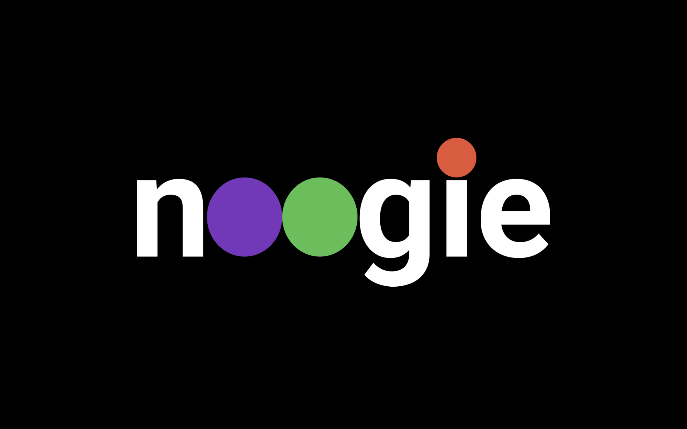
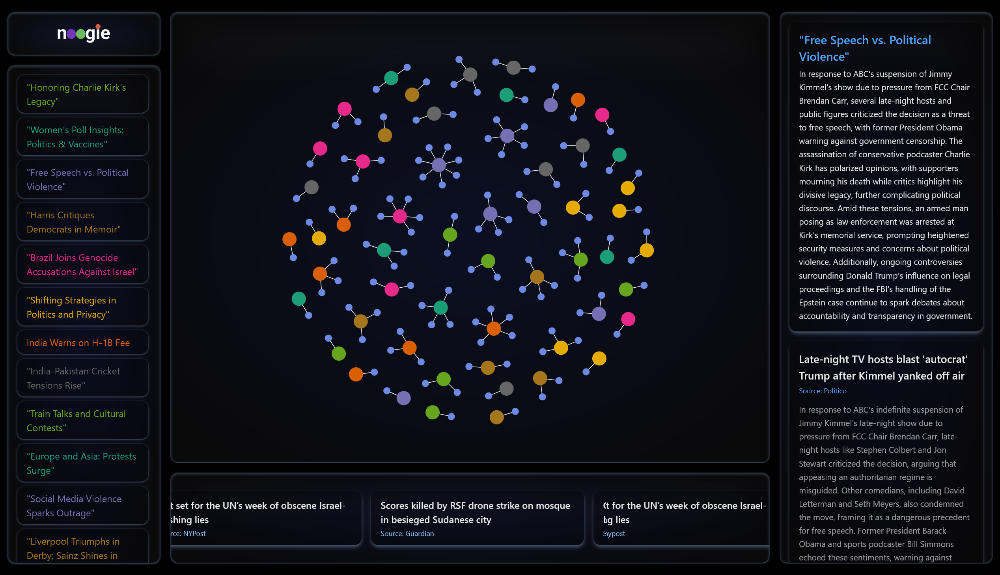
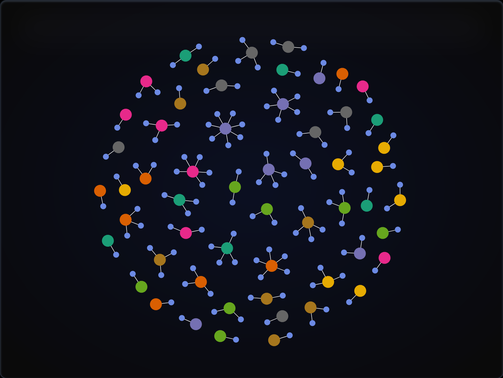

# noogie - News through a different lens




A project built to collect, duplicate, cluster, and summarize breaking news stories from across the web to mitigate biases that different news sources give. 

## Overview

noogie automatically fetches articles from major outlets, groups similar stories, and generates concise AI-powered headlines.
It helps users see the big picture of what’s happening, filtering the opinions of different news sources.



## Features

* Multi-Source Collection – Pulls stories via RSS and scraping from a variety of news sources
* Clean Parsing – Uses newspaper4k to extract titles and content, filtering out empty or paywalled pages.
* Smart Deduplication – Computes sentence embeddings (sentence-transformers) and stores them in a FAISS vector index
* Clustering & Summarization – Groups similar articles and calls OpenAI/Gemini to generate short, human-readable cluster headlines
* Scalable Design – Supports multithreading (planned) so multiple feeds can be fetched concurrently.


## Tech Stack
* TypeScript + React with `d3.js` for node visualization
* Python `newspaper4k` to extract news sources & `flask` for the servers
* OpenAI's GPT 4o-mini for summaries
* Supabase for storage

## Usage
``` 
cd front-end
npm install
npm run dev
```

```
cd server
python -m venv
pip install -r requirements.txt
python app.py
python upload_clusters.py
python server.py
```
## API Endpoints
- `GET` api/clusters
- `GET` api/articles
- `GET` api/clusters/:clusters_id/articles
- `GET` api/clusters/:cluster_id
- `GET` api/articles/:article_id
- `POST` api/clusters/batch
- `POST` api/data/bulk
- `POST` api/clusters/:cluster_id/articles/batch


## Acknowledgements
A special thanks to PennApps 2025.


## License 
Copyright (c) 2025 Jatin Punjabi, Andres Lopez, Ruslan Akmyradov
